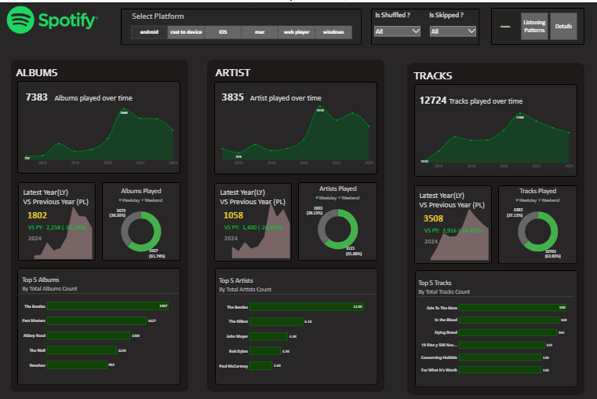
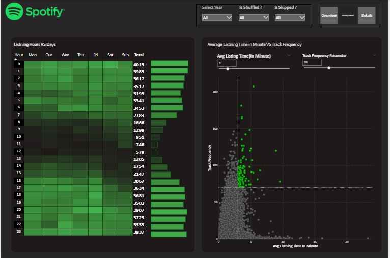
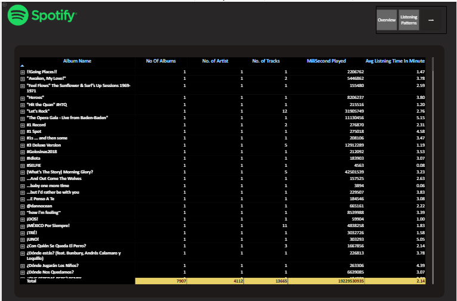

# 🎵 Spotify Music Analytics Dashboard – Power BI & SQL

## 📌 Project Overview

This project presents an interactive **Spotify Music Analytics Dashboard** built using SQL and Power BI.  
The dashboard analyzes track performance, artist trends, genre distribution, and audio features to uncover music listening patterns and popularity insights.

The report is structured into three analytical layers:

1. Overview  
2. Patterns  
3. Details  

This layered approach enables both executive-level insights and deep-dive analysis.

---

## 🛠 Tools & Technologies Used

- SQL (Data extraction, transformation, aggregation)
- Power BI Desktop
- DAX (Measures & KPI calculations)
- Data Modeling (Fact-Dimension structure)
- Interactive Filtering & Drill Analysis

---

## 📊 Report Structure

### 1️⃣ Overview Page
High-level summary of overall performance:

- Total Tracks
- Total Artists
- Total Streams / Popularity Score
- Average Track Popularity
- Genre Distribution
- Top Artists
- KPI indicators with rule-based formatting

Purpose: Executive snapshot of overall Spotify dataset performance.

---

### 2️⃣ Patterns Page
Trend and behavioral analysis:

- Popularity trends over time
- Genre-wise growth patterns
- Audio feature analysis (Danceability, Energy, Tempo, etc.)
- Track release year distribution
- Correlation insights between features and popularity

Purpose: Identify listening patterns and performance drivers.

---

### 3️⃣ Details Page
Granular drill-level analysis:

- Track-level breakdown
- Artist-level performance comparison
- Genre segmentation
- Detailed filtering by year, artist, or popularity range

Purpose: Deep-dive exploration for analytical insights.

---

## 🖼 Dashboard Preview

---

## 🎯 Business Objective

- Identify high-performing artists and tracks
- Analyze genre popularity trends
- Understand audio feature impact on popularity
- Detect long-term listening patterns
- Support music strategy and recommendation insights

---

## 🧠 Key Insights Enabled

- Which genres dominate popularity?
- Do audio features influence track success?
- Which artists consistently perform well?
- How has music popularity evolved over time?

---

## 🔗 Live Dashboard

[View Live Dashboard](https://app.powerbi.com/groups/me/reports/504b1cf6-c87b-4414-935c-589e6f2e3725/4507a7d026a69053ee56?experience=power-bi)

---

## 💼 Portfolio Value

This project demonstrates:

- SQL-based data preparation
- Data modeling best practices
- Advanced DAX calculations
- Multi-page dashboard storytelling
- Executive + analytical report design
- Business-focused insight generation

